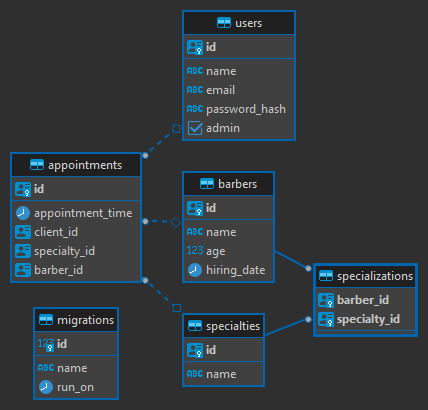

# ClickBeard

Sistema de agendamento para barbearia

## Rodando localmente

- Crie uma cópia do arquivo .env.example - tanto o da pasta api quanto o da pasta web - no mesmo diretório com o nome de `.env` . Os valores fornecidos no arquivo de exemplo são os ideais para rodar a aplicação sem precisar editar as variáveis.

### Rodando a api

- Dentro do diretório api, execute o comando `npm install` para instalar suas dependências.
- Você precisará de uma instância do PostgreSQL rodando para executar o próximo passo. O nome do banco deverá ser o mesmo que o configurado no .env. Modifique as variáveis de ambiente caso necessário.
- Execute o comando `npx db-migrate up` para rodar as migrations do banco de dados.
- Inicie a aplicação com `npm run start:dev` . Aguarde a mensagem de sucesso.

### Rodando o cliente web

- Já no diretório web, execute o comando `npm install` para instalar as dependências.
- Execute `npm run dev` para iniciar a aplicação. Ela ficará disponível em http://localhost:5173 .

## ⚠ IMPORTANTE ⚠

- O sistema divide os usuários entre admin e não admin. O primeiro usuário cadastrado terá o cargo de admin, os demais não.
- Nas migrations já existem alguns barbeiros e especialidades cadastradas.

## Base de dados

PostgreSQL

## Requisitos

### Funcionais

- [ ] Deve ser possível cadastrar barbeiros
- [ ] Deve ser possível cadastrar especialidades
- [x] Os clientes devem poder se cadastrar
- [x] Os clientes devem poder logar no sistema
- [x] Os clientes devem poder agendar horários
- [ ] Os clientes devem poder cancelar agendamentos
- [ ] Os clientes devem poder visualizar seus agendamentos
- [ ] O ADM deve poder visualizar os agendamentos futuros

### Regras de negócio

- [x] Usuários não podem se cadastrar com emails que já estão em uso
- [x] Usuários só podem realizar agendamentos após se autenticarem
- [x] Usuários precisam especificar um barbeiro para agendar horários
- [x] Um barbeiro não pode atender dois clientes no mesmo horário
- [x] Um barbeiro pode ter mais de uma especialidade
- [x] Um agendamento só pode ser cancelado até duas horas antes do horário marcado
- [ ] Barbeiros só podem ser cadastrados por ADMs
- [ ] No momento de agendar horário, os barbeiros devem ser listados por especialidade
- [x] Não podem existir mais de uma especialidade com o mesmo nome

### Não funcionais

- [x] As senhas dos usuários devem ser criptografadas
- [x] A autenticação de clientes deve se dar a partir de um JWT
- [x] Os dados da aplicação deverão ser persistidos em um banco ProtgreSQL
- [x] A barbearia funciona todos os dias de 8:00h às 18:00h
- [x] Um atendimento demora exatamente 30 minutos
- [ ] A API deve ser documentada utilizando o Swagger
- [x] O processo para executar a aplicação localmente deve ser documentado
